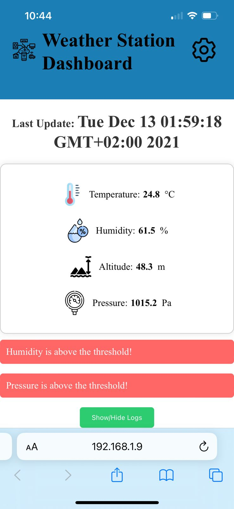
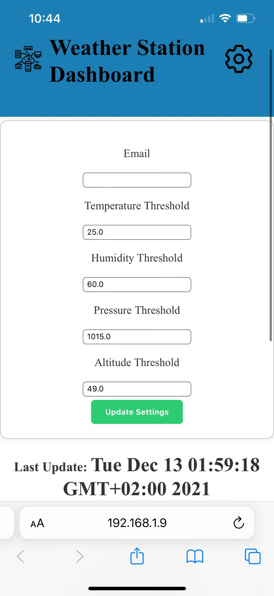

# Weather Station

This is a simple web application built using Spring Boot, h2 database and Thymeleaf. The application displays the data from the sensors and also allows the user to set thresholds for the sensors. If the data crosses the threshold, an alert is shown on the web page.

This project is a part of my learning process of Spring Boot. If you're interested in learning Spring Boot, I would recommend you to check out my repository [SpringBoot-LearningHub](https://github.com/SalmaAlassal/SpringBoot-LearningHub).

# Hardware

The hardware used for this project is:
- ESP32
- DHT22 for measuring temperature and humidity
- BMP180 for measuring pressure and altitude

# Snapshots

|||
|----------------------------------|----------------------------------|